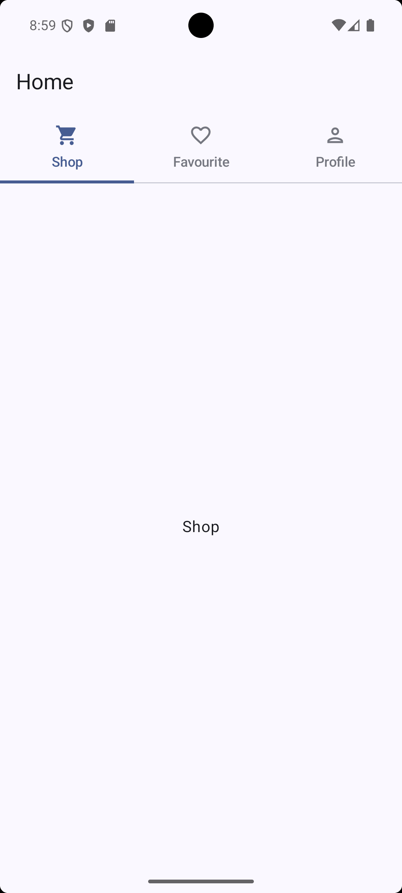

# ComposeTabRowPager

A Jetpack Compose demo showcasing TabRow with HorizontalPager using Material 3.

## 📱 About The Project

This project demonstrates how to implement TabRow with HorizontalPager in Jetpack Compose using Material 3 components. 

It includes:
- TabRow navigation
- HorizontalPager integration
- Smooth animated tab switching
- State management using rememberPagerState
- derivedStateOf usage
- Coroutine scope handling

This project is built using modern Android development practices.

---

## 🛠 Built With

- Kotlin
- Jetpack Compose
- Material 3
- Coroutine

---

## 📂 Features

- Three tabs: Shop, Favourite, Profile
- Dynamic icon change on selection
- Smooth pager animation
- Clean UI structure using Scaffold

---

## 🚀 Learning Purpose

This project is created for learning and practicing Jetpack Compose UI components and state handling.

---

## 📸 Screenshots

---
